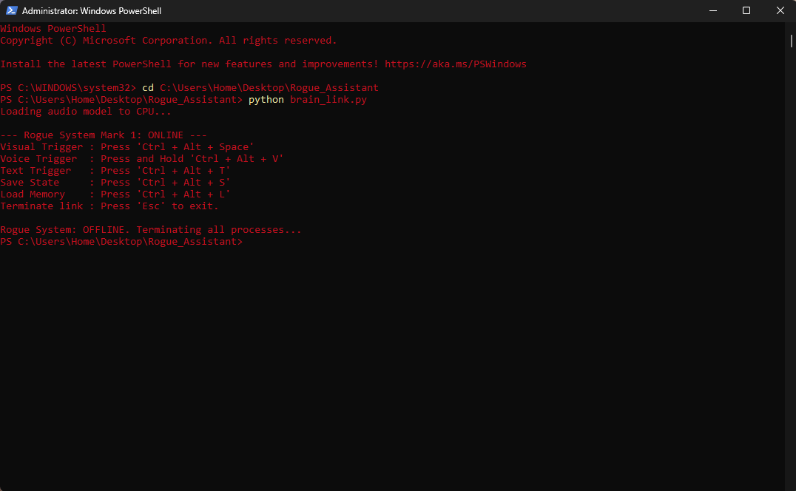

# Rogue Assistant (Mark 1)

Rogue is a highly advanced, locally hosted, multimodal AI assistant designed to operate entirely offline within a Windows PowerShell environment. Built to mimic a high-end, executive AI, Rogue features global system hooks, vision processing, local speech-to-text, and near-instant text-to-speech feedback.

The Mark 1 architecture is specifically heavily optimized for mid-range hardware (e.g., NVIDIA RTX 2060 Super 8GB), employing aggressive tensor compression and dynamic VRAM management to maintain high speed without crashing the host system.

## Core Features

* **100% Offline Architecture:** Powered by an uncensored local LLM (Qwen3.5-4B) via Ollama. No API keys, no subscriptions, and zero internet reliance.
* **Spatial Vision (Screen Context):** Utilizes global hotkeys to snap screen context. Images are aggressively downscaled to 480p and converted to grayscale before tensor processing, maintaining a strict ~6.3-second TTFT while protecting system VRAM.
* **Local Voice Processing:** Implements `faster-whisper` for on-device speech-to-text transcription.
* **Intercepted TTS Audio Pipeline:** Uses Piper TTS for instantaneous voice generation. Audio is intercepted via `scipy` and `numpy` arrays to bypass rigid Windows system volume limits and allow custom software-level volume scaling.
* **Memory Vault System:** Features a custom session summarization tool that compresses current context into a dense text vault, allowing Rogue to load and "remember" past sessions across complete system reboots.
* **Global API Hooks:** Runs as an asynchronous background daemon listening for specific hotkey combinations, regardless of the active application.

## Tech Stack & Requirements

* **Language:** Python 3.x
* **Core Inference:** [Ollama](https://ollama.com/) (Running `Qwen3.5-4B-Uncensored`)
* **Text-to-Speech:** [Piper TTS](https://github.com/rhasspy/piper) (Using `en_US-kristin-medium`)
* **Speech-to-Text:** [faster-whisper](https://github.com/SYSTRAN/faster-whisper)
* **Libraries:** `requests`, `pyautogui`, `keyboard`, `sounddevice`, `numpy`, `scipy`, `Pillow`

## Installation & Setup

1. **Clone the repository:**
       git clone [https://github.com/encualex03/Rogue_Assistant.git](https://github.com/encualex03/Rogue_Assistant.git)
       cd Rogue_Assistant

2. **Install Python Dependencies:**
       pip install -r requirements.txt

3. **External Binaries Required:**
   * Install **Ollama** and load the appropriate Qwen3.5 GGUF and mmproj adapter files into your local directory.
   * Download the **Piper TTS** Windows executable and the `en_US-kristin-medium.onnx` voice model. Place them in a `/piper` directory at the project root.

4. **Execution:**
   Run the terminal as **Administrator** (required for global keyboard hooks to bypass Windows security restrictions).
       python brain_link.py

## Global Controls (Hotkeys)

Once initialized, Rogue runs as a background process listening for the following commands:

| Command | Hotkey | Action |
| :--- | :--- | :--- |
| **Visual Trigger** | `Ctrl + Alt + Space` | Snaps a 480p grayscale screenshot and analyzes active code/windows. |
| **Voice Trigger** | Hold `Ctrl + Alt + V` | Records microphone input, transcribes via Whisper, and sends the prompt. |
| **Text Trigger** | `Ctrl + Alt + T` | Opens a secure GUI input box for silent commands. |
| **Save State** | `Ctrl + Alt + S` | Compiles the active session into a dense summary and saves to disk. |
| **Load Memory** | `Ctrl + Alt + L` | Injects the saved memory vault into the active context window. |
| **Terminate** | `Esc` | Instantly kills all daemon threads and closes the link. |

## System Directives & Persona

Rogue is tuned via her `Modelfile` to be clinical, concise, and highly efficient. She utilizes action-oriented phrasing ("Analyzing," "Executing," "Confirmed") and is strictly programmed to provide conclusions first, followed by supporting technical details. She is fully aware of her host hardware constraints and manages her logic accordingly.

---
*Mark 1 Architecture finalized. Pending Mark 2 modular expansion.*